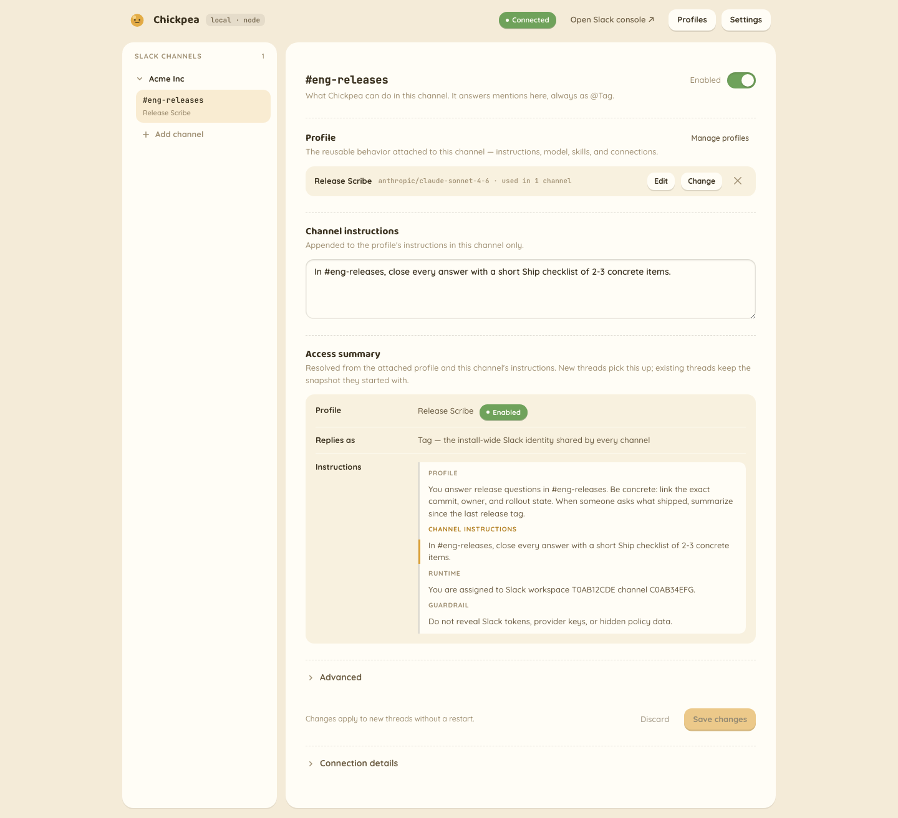

#  Chickpea

**Self-hosted, model-agnostic AI agent for Slack. One click to your own Cloudflare account — your first DM answers before you add a single model API key.**

Chickpea is a present Slack teammate: an `@`-mention guarantees engagement, joined-thread replies and DMs continue naturally, and assigned channels may selectively promote useful unmentioned messages. Every channel can get its own profile: separate instructions and model, imported skills, approved MCP/API connections, and exact GitHub repository grants. Channels can retain explicit team memory and own scheduled work on Cloudflare, using the capabilities of their attached profile, all managed from a role-gated `/admin` page. It is built for teams that want an AI agent in Slack without routing messages, tokens, or model traffic through someone else's cloud: your Slack credentials live in your own Cloudflare Durable Object (or your own SQLite file), model calls go directly to the provider you pick, and this project hosts nothing. Built on [Flue](https://www.npmjs.com/package/@flue/runtime). MIT-licensed.



**Is this for you?** The hard constraints, up front (details under [Good to know](#good-to-know)):

- One deploy serves **one Slack workspace** — no multi-workspace OAuth distribution yet.
- On Cloudflare's free tier, the Workers AI and Durable Object daily caps are **hard errors** under load; adding a provider key and pinning profiles away from Workers AI moves model spend.
- Fresh installs use built-in invitation-only accounts with Chickpea-owned `owner`, `admin`, and `member` roles. Cloudflare Access remains optional for advanced existing deployments.
- **Updates are manual**: the Deploy button clones this repo (it does not fork), so upgrading is a re-deploy. The open-source v1 release starts from a clean, consolidated schema; migrations added after that public baseline are append-only.
- **Durability is single-host** — multi-instance deployments would need a shared store first.

## Deploy to Cloudflare

[](https://deploy.workers.cloudflare.com/?url=https://github.com/pejmanjohn/chickpea)

The public Deploy button installs the slim runtime and built-in authentication in your own Cloudflare account:

1. **Click Deploy.** There is no Chickpea secret to invent or save. The deploy creates its internal signing authority, provisions the Worker and D1 database, and finishes with one private setup link.
2. **Open the private link.** It asks only for the owner's email, password, and password confirmation, then continues directly to onboarding.
3. **Create @Chickpea in Slack.** The button opens Slack with this installation's manifest already filled in. Pick the customer workspace and install its customer-owned app.
4. **Paste two Slack values.** Return with the Bot User OAuth Token and Signing Secret. Chickpea verifies the signed Slack setup event, workspace, app, required scopes, and channel access, then normally continues automatically. If Slack needs one more permissions step, choose **Continue in Slack**, finish there, return, and choose **Check again**. The two values stay in place, so you do not paste them again.
5. **Choose one channel and try Chickpea.** The channel picker opens immediately. Chickpea completes onboarding only after a real `@Chickpea` mention receives a visible reply in that channel.

See [Authentication and roles](docs/authentication.md) for accounts, sessions, invitations, roles, optional Access, and Cloudflare-backed break-glass recovery. The [recovery runbook](docs/runbooks/password-recovery.md) explains how a Cloudflare account holder can temporarily enable one recovery without adding a recovery-code step to normal onboarding.

The first DM answers with **zero model keys** on a fresh Cloudflare deploy: the seeded Default profile is explicitly pinned to [`cloudflare/@cf/zai-org/glm-5.2`](https://developers.cloudflare.com/workers-ai/models/glm-5.2/) through the Workers AI binding — that link is its Workers AI model page, so you can check availability on your plan before deploying. If the model errors on your account, the failure surfaces as one sanitized reply in the thread; pin any other model in `/admin`. Add an `ANTHROPIC_API_KEY` secret, or paste it in Settings, to make Claude models available in the picker; keys do not silently switch a pinned profile.

## What it does

### In Slack

- Guarantees engagement for `@`-mentions, joined-thread replies, and DMs, while assigned channels evaluate useful unmentioned messages individually. Ignored ambient chatter creates no Work, Run, transcript, memory receipt, or durable message body.
- Uses reactions as complete low-noise replies when words would be noise. Longer work adds `:eyes:` before one editable checklist, always produces a written result, finalizes the checklist, and removes the acknowledgment it created.
- Fetches bounded Slack context only for the current decision or turn. Ambient participation is not a persistent workspace-message index.
- Runs saved channel routines on Cloudflare schedules, including read and write work, with the same current channel authority as a live `@`-mention.
- Keeps explicit, team-owned channel memory: members can remember, inspect, correct, merge, report, and irreversibly forget small Markdown notes that carry across Slack threads.
- Renders standard Markdown natively (tables, lists, blockquotes, fenced code/diff blocks) and signs every reply with the profile and model that answered.
- Absorbs Slack's duplicate retries while an event claim is held, so normal redelivery produces one final reply and one provider call. If the provider succeeds but Slack rejects final delivery, the claim is released so Slack can retry the event; that recovery can call the provider again.

<details>
<summary>The full behavioral contract</summary>

- Continues a thread without re-mentioning: once the bot has replied in a thread, later human replies keep the session going. The joined-thread registry is durable (it survives restarts and redeploys) and expires after 30 days of thread age.
- Assigned channels default to **Ambient (mentions guaranteed)**. The Channel page can narrow one channel to mention-only, and `SLACK_TAG_AMBIENT_PARTICIPATION=false` is the installation-wide emergency rollback. These controls change participation, not teammate authority or profile capabilities.
- Any eligible channel member may initiate or steer reversible work already allowed by the attached profile, including repository work. A mention guarantees attention; it is not a privilege boundary.
- Answers DMs and App Home messages without mention syntax. On by default; `SLACK_TAG_ALLOW_DMS=false` makes it channels-only.
- Context windows are prompt-derived: a top-level mention like "summarize this week" pulls same-channel history over `today`, `yesterday`, `this week`, `last week`, `since Monday`, `last 2 days`; anything vague defaults to the last 24 hours. Thread reads cap at 50 human-authored messages, with bot and system replies filtered out.
- Shows one generic Assistant status line (`Chickpea is thinking...`) while a turn is active and clears it at the terminal seam. Longer work also uses the durable checklist above, so progress remains visible if Slack rejects Assistant status.
- Semantic reactions are adapter-owned and explicitly targeted: agreement uses `:+1:`, done uses `:white_check_mark:`, seen/work pickup uses `:eyes:`, appreciation prefers `:pray:`, mid-work acknowledgment prefers `:ballot_box_with_check:`, and known merged/failed/approved state changes use the workspace convention with a standard fallback. A missing custom emoji advances the fallback chain; reaction-only delivery falls back to one line of text only after a confirmed delivery failure.
- An eligible member can tell Chickpea to respond only when mentioned for the current channel or thread, and can re-enable ambient participation the same way. Ambient messages and reactions cannot mutate these controls.
- The reply footer carries the profile name, the resolved model, and a Configure link into `/admin` when `SLACK_TAG_PUBLIC_URL` is set.
- Posts one onboarding message when invited to an assigned channel: mentions guarantee a response, ambient contributions are selective, joined threads continue, and bounded per-message context is not persistently indexed.

</details>

### Operator controls (`/admin`)

- A single self-contained admin page. Better Auth verifies the built-in browser session; Chickpea resolves its live membership and enforces `owner`, `admin`, or `member` permissions on every request. Suspending or removing someone revokes their sessions and personal tokens.
- Team administration uses one exact-email, seven-day join link per pending teammate. Chickpea sends no invitation email: an administrator copies the same private link whenever needed and shares it through a trusted channel. A public no-store handoff moves the secret from the URL fragment into same-tab storage and removes it from browser history. New users choose a password; existing users sign in normally and resume. Use, revoke, expiry, mismatch, and replay fail closed.
- Reusable profiles: name, model, instructions, enabled skills, remote MCP and HTTP API connections with explicit approvals, exact repository grants, and an enable toggle. Disabling a profile blocks DMs and new channel threads; existing channel threads keep the frozen profile snapshot they started with.
- Skills can be imported by pasting any public `owner/repo`, GitHub URL, or skills.sh link. When the GitHub App is connected, the same field can also resolve App-accessible private repositories, and **Browse GitHub** can fill it from the connected installations without limiting public paste to repositories you own.
- Per-channel assignments: add a channel by workspace + channel ID, choose ambient or mention-only participation, enable/disable it, swap the attached profile, or detach it. Per-channel instructions append to the profile's instructions in that channel only.
- Model pinning: a combobox showing concrete models grouped by the providers this install actually has configured. Any free-text `provider/model` specifier is accepted; unknown providers get a warning.
- A read-only Access summary showing the attached profile, effective Slack identity, and layered instructions. Advanced shows the resolved model, provider, and short config snapshot hash; the profile's Skills, Connections, and Repositories tabs show its capability grants.
- The first-run Slack connection wizard described above, followed by a live Slack overview that reads the installed bot's current name and avatar, links to the exact Slack settings page for changing them, tests or replaces stored credentials, and confirms disconnects. Ambient participation, DM, unassigned-channel hint, and welcome-message behavior is configurable there; environment-managed values remain visibly read-only.
- Profile and channel edits apply to new threads without a restart; DMs deliberately track current configuration.
- Audit Logs > Scheduled Work starts with a compact, filterable routine inventory. Opening one routine separates its saved definition and controls from its Runs and Activity, including revisions, usage, safe failures, Slack receipts, and durable Flue agent attempts. Audit Logs > Memory keeps the workspace/channel memory browser with generated `MEMORY.md` indexes, escaped file previews, optimistic editing, revision history, review resolution, and irreversible deletion. Network Events remains reserved.

### Channel memory

Channel memory is always available in eligible assigned Slack channels; there is no enable switch or environment flag. Creation is explicit but does not require rigid command syntax: direct phrases such as “Please remember that…” are accepted, while Chickpea does not silently save facts from normal conversation. Direct-message memory, past-session browsing, automatic curation, and vector search are intentionally deferred.

Use these commands in an admitted channel turn:

```text
Please remember that <what matters>
Please update the memory <slug> to say that <new guidance>
!memory
!remember <name> — <description>
<Markdown body on the next line>
!memory show <slug>
!memory update <slug> — <description>
<replacement body on the next line>
!memory merge <slug-a> <slug-b> as <name> — <description>
<merged body on the next line>
!memory report <channel-id>/<slug> <stale|incorrect|unsafe|unclear>
!forget <slug>
!forget confirm <one-time token>
```

Public-channel entries are grouped by their source channel, readable from eligible public channels workspace-wide, and editable conversationally only from their source channel. A private channel reads its own isolated generation plus workspace-public memory read-only, and writes only to that private generation. A private-to-public conversion seals the old private generation; later public turns do not read it. Slack Connect/shared channels, unresolved scope or actor identity, bots/apps, guests, foreign users, and failed live membership proof do not receive expanded memory access. DMs have no memory in this release.

Memory is advisory data, never policy. The prompt labels every entry untrusted and potentially stale; current profile instructions, the current Slack request, live repository/tool permissions, spend and egress limits, and fresh Slack scope checks always win. A changed scope or selected entry invalidates the delivery lease so stale model text is not posted.

The bounded defaults are 64 entries per source channel; 512 entries/1 MiB in the public workspace store; 128 entries/256 KiB in a private store; 512-byte descriptions; 8 KiB bodies; and at most 8 entries/8 KiB in a turn prompt. Ninety-day age marks an entry stale for ranking but does not delete it. Credential-like content is rejected. Mutation rate windows allow 30 actor changes and 120 channel changes per hour.

Canonical state is structured SQLite/Durable Object data projected deterministically as portable Markdown and an uncompressed tar export; the filesystem is not required. The generated `MEMORY.md` files are read-only. Import is previewed, path/hash checked, bounded, and applied atomically. Admin edits use expected versions and preserve a draft across conflicts.

An active Chickpea `owner` or `admin` can access retained memory, including view, edit, review, and delete in the Admin UI; ordinary members cannot. Deterministic export/import remain API-level portability and recovery capabilities rather than everyday admin controls. Forget/delete scrubs canonical entry and revision content and prevents it from being supplied again, while retaining body-free tombstones and audit facts. It cannot retract copies already present in Slack messages, model-provider processing/logs, prior exports, backups, or separate Flue transcripts; those systems keep their own retention controls.

### Routines and scheduled work (Cloudflare)

Routines are channel-owned recurring or one-time future requests. One clear natural-language request in an assigned channel creates or edits the scheduled work immediately; Chickpea replies with the normalized schedule, explicit time zone, saved task, output policy, and live-authority disclosure. Only irreversible deletion requires a second confirmation. The exact source Slack request is retained with each revision, and the normalized task is rejected if it adds an effect absent from that request or an inherited prior revision. A routine may read or write when its saved task asks it to: that saved request is the approval, using the same policy as a live tag, with no second per-routine permission matrix or token confirmation. Every occurrence re-resolves the creator's channel membership, the bot's channel access, the current profile/model, connections and shared credentials, repository grants, memory scope, egress policy, spend bounds, and sandbox availability. Saved tasks, memory, channel history, fetched content, and tool output are untrusted inputs and can narrow work but cannot grant new authority.

```text
Every weekday at 9am America/Los_Angeles, review open support requests, update the configured tracker, and post a summary here.
Tomorrow at 2pm America/Los_Angeles, post the launch report here.
Pause the routine "Support review".
!routines
!routines <#channel>
!routines show <id>
!routines pause <id>
!routines resume <id>
!routines disable <id>
!routines run <id>
!routines clone <id>
!routines delete <id>
!routines confirm <deletion token>
!routines cancel <deletion token>
```

Any current member of the owning channel can list, inspect, edit, pause, resume, disable, run, clone, or delete its routines. Natural-language management resolves an exact name only when that name appears in the current message; duplicate names produce an ambiguity response with stable IDs and make no change. The `!routines` ID commands remain the deterministic fallback. One-time jobs cannot be run-now or cloned; create another future job instead. Cross-channel listing first proves the requesting member and bot can access the mentioned channel and otherwise returns the same non-disclosing response as an unknown ID. Its result or failure is an ephemeral message in the invoking channel that only the requester can see. If the creator leaves the organization but remains a channel member, the routine can continue; if the creator is removed from the channel, Chickpea disables it before constructing an Agent or tools. A profile, connection, credential, repository, or policy change takes effect at the next occurrence without editing the routine. Actor-personal credentials are never delegated to unattended work.

The persisted schedule is either a five-field cron expression or one exact future local date/time, always paired with an explicit IANA time zone. People can use familiar phrases such as `10am PT` or `10am Pacific`; Chickpea normalizes those to an IANA zone before persistence. If the request omits a zone, Chickpea uses the requesting member's Slack profile zone when available and otherwise UTC, and shows the selected value in the receipt. Recurring schedules run no more often than every five minutes. Ambiguous fall-back times select the first instant; nonexistent spring-forward times are rejected instead of silently shifted. A fixed one-minute Cloudflare Cron Trigger finds due definitions and admits one independent app-owned occurrence. That occurrence dispatches a fresh Flue 2 agent with a stable idempotency key, persists its receipt before reading, and never reuses a Slack conversation. Downtime does not burst catch-up work: Chickpea records missed recurring slots and considers only the latest slot, skips any work more than 15 minutes late, and skips an overlap while the same routine is active. A one-time job is claimed at most once and becomes `completed` after its terminal outcome, including a visible missed/skipped outcome. `post_on_change` routines suppress an unchanged result; an explicit no-op never posts.

Writes are not blindly retried after execution begins. Ambiguous agent admission repeats only the exact frozen request and key; a saved receipt reattaches `read()` without dispatch, and a saved settlement retries only delivery. Slack delivery is one at-most-once attempt with a durable receipt. A delivery or tool outcome that may have succeeded but cannot be proven pauses the routine immediately for inspection. Three attributable failures pause it; live access failures disable it; infrastructure/capacity failures remain visible without pretending the saved task is bad. A successful occurrence resets the streak, and a deliberate resume resets it too. Terminal notices are sanitized and deduplicated.

The hard deployment defaults are 100 active routines, 20 per channel, 300 scheduled starts per routine per day, 600 scheduled starts per deployment per day, 10 run-now starts/day, 610 total starts per rolling day, eight starts per rolling 15 minutes, four concurrent runs deployment-wide, one active run per routine, a five-minute minimum recurring interval, a 15-minute admission grace/deadline, and 25 due claims per heartbeat. Recurring validation calculates the maximum rolling-day rate across 370 days; one-time jobs reserve only their single instant. Collision previews persist only the next three fires or 48 hours of five-minute fires and refresh as each slot advances. The eight-start rolling limit is enforced again transactionally when work is actually queued. Scheduled Work exposes these bounds, source-request provenance, completed one-time jobs, and occurrence history. Product-owned run and audit metadata is retained for 365 days; confirmed deletion immediately scrubs the saved task and source-request body from the routine revisions while retaining body-free hashes and audit facts. Slack messages, provider processing/logs, backups, and Flue's separate conversation history have their own retention and cannot be retracted by Chickpea.

The feature is Cloudflare-only for now and is always active on supported Cloudflare deployments. The deploy wrapper refuses an artifact unless the heartbeat Cron, `TAG_STATE`, and both fresh Flue 2 routine-agent bindings and registrations are present. If a release must be reverted, roll the Cloudflare deployment back to a known-good version; do not remove the Cron, v2 agent bindings, Durable Object state, or migrations as a shortcut. Node honestly rejects create/edit/resume/run-now while retaining list/show/pause/disable/delete and Admin inspection; it does not start an in-process timer.

For troubleshooting, start in Audit Logs > Scheduled Work and inspect the safe failure class, app-owned attempt, Flue receipt checkpoint, and Slack receipt. Repair current access for `creator_ineligible`, `channel_ineligible`, `assignment_missing`, `credential_unavailable`, or `access_denied`; Chickpea never falls back to another credential. Reattach a saved Flue receipt before acting on `admission_unknown`, and inspect the external target before resuming `unknown_external_outcome` or `delivery_unknown`, because the write or post may already exist. Capacity and Slack-rate-limit failures remain visible and are not silently retried. Resume only after the cause is understood; it resets the failure streak without erasing history. Heartbeat logs contain stable event names, counts, maintenance totals, and duration only—never task text, prompts, channel content, credentials, model output, actor identifiers, or raw errors.

### Skills

Open a profile's Skills tab and choose **Import from URL**. The source field is always free-form: paste another person's public repository, a GitHub URL, or a skills.sh page, then choose **Find skills**. Use `owner/repo@skill` to select one skill in a large repository; scans inspect at most 40 skill directories.

If this deployment's GitHub App is connected, **Browse GitHub** searches its installations and includes private repositories. Choosing a result only fills the same editable `owner/repo` field. Pasting an exact private source works too when the App can access it, including when bounded discovery does not show it. Chickpea first tries the anonymous public path, then verifies private access against that exact repository and uses a short-lived, one-repository App token with Contents read permission. Personal access tokens and browser-supplied installation IDs are not used.

An import is a one-time snapshot, not a live link: the selected `SKILL.md` name, description, and instructions are copied into the profile draft, replace a same-named skill, and persist only when you save the profile. Those instructions may be sent to the profile's configured model when the skill is used. Scripts, assets, plugin manifests, and other repository files are not copied or executed.

Skill-source access is separate from runtime repository access. Importing from a repository does not add it to the profile's Repositories tab, and removing a runtime repository grant does not delete an already imported skill snapshot. Add a repository grant separately only when the profile itself should read or change that repository during a turn.

### Connections

Open a profile's Connections tab to add capabilities from the built-in gallery or configure a custom connection. The gallery includes OAuth and credential-based remote MCP services such as Linear, Atlassian, Notion, Sentry, Stripe, Cloudflare, Supabase, PostHog, and Airtable, plus direct API connections for Google Workspace, Asana, and Zendesk. Google Workspace uses one bring-your-own OAuth client and a shared authorization for the Gmail, Calendar, and Drive services you enable.

Connections are profile-scoped, while credentials, OAuth tokens, and dynamic client registrations are stored outside model-visible profile configuration. MCP servers expose only the tools approved for that profile. HTTP API connections are independently constrained to their configured hosts, path prefixes, and methods; credentials are injected only at the network boundary. A connection cannot widen the install's broader egress or side-effect policy.

OAuth connections surface their current identity and lifecycle state, including when reconnect is required. Changes apply to new Slack threads without restarting the app. Scheduled routine occurrences deliberately re-resolve the profile's current connections and shared credentials each time they run; Chickpea does not delegate actor-personal credentials to unattended work.

### Repositories

Connect GitHub once in Settings through the GitHub App manifest flow, the only supported authentication path for repository access and the coding sandbox. Then pick exactly which repositories each profile can use from its Repositories tab. On Cloudflare Workers, Chickpea mints down-scoped, short-lived App installation tokens per turn and injects them only at the coding sandbox egress boundary; credentials never enter agent instructions or the sandbox environment. The container coding tier requires Cloudflare Workers. Node and other non-Cloudflare installs keep the standard in-memory bash sandbox, with no host filesystem or host git/SSH credential access.

### Optional coding sandbox

The default Deploy to Cloudflare path is intentionally slim: it does not create a Sandbox binding, build the Ubuntu-based image, or provision a Container application. Ordinary Slack replies and Chickpea administration do not need that infrastructure.

To add repository-backed coding later, open **Settings → Coding sandbox → Install coding sandbox**. Chickpea records the request, but deployment authority remains in your Cloudflare account. In **Cloudflare dashboard → Workers & Pages → your Worker → Settings → Builds → Variables**, add the non-secret build variable `CHICKPEA_DEPLOY_PROFILE` with value `sandbox`, then choose **Retry deployment**. If Retry reuses the earlier core artifact, start a fresh dashboard build. A local or CI operator can instead run `npm run deploy:sandbox`. The Sandbox profile requires Workers Paid, and its first image build can take several minutes.

After the deployment finishes, use **Check again**, verify the application is ready under **Cloudflare dashboard → Containers → Container applications**, connect GitHub, grant at least one repository to a profile, and explicitly enable the runtime. Disabling is immediate but does not delete the retained Container application or image. For a full removal, disable first, remove the build variable, redeploy the core profile, verify normal Slack behavior, and only then delete the retained Container resources. If upgrading an older Sandbox beta, keep the Sandbox build profile before the update to retain its binding; choosing the default slim profile intentionally removes Container access and requires runtime enablement to remain off until Sandbox is reinstalled. See the [coding sandbox deployment runbook](docs/runbooks/coding-sandbox-deployment.md) for upgrades, rollback, and troubleshooting.

### Privacy and fail-closed guarantees

- Channels are fail-closed, public and private alike: the bot answers only where a profile is explicitly assigned. Being invited to a channel does nothing by itself.
- A mention in an unassigned channel posts nothing to the channel. The mentioner alone gets one rate-limited ephemeral hint linking to that channel's `/admin` page (`SLACK_TAG_UNASSIGNED_HINT=false` turns even that off).
- Every operational event is signature-verified; a tampered signature gets a 401 and no side effects. The one pre-setup exception is Slack's unsigned `url_verification` challenge, which is echoed before credentials exist so Retry works mid-setup.
- A fresh Cloudflare deployment exposes only recovery-gated owner setup until built-in authentication activates. Afterwards, a valid Better Auth session is still insufficient without an active Chickpea membership and role.
- Bounded channel context may be fetched to classify an eligible ambient message or build an admitted turn, but ignored ambient bodies are not copied into Work, Runs, transcripts, memory, or decision telemetry. There is no passive workspace-message index. Separately, explicit channel memory persists small team-authored notes, their revisions/audit envelope, scope lifecycle, and bounded selection epochs. Each promoted thread keeps its own agent transcript, dedupe claims, and config snapshot.
- A thread freezes its resolved profile, model, instructions, skills, MCP/API connection approvals, and repository grants at its first durable turn. Admin edits apply to new threads only; in-flight conversations keep the config they started with, even across retries or a later profile edit. DMs deliberately track current config instead.
- Failures degrade loudly, never silently: a provider error, an unresolvable model, or a context-read failure each still deliver one sanitized final reply and clear the status line.

### Models

- Anthropic, OpenAI, and OpenRouter are built-in providers. Add `ANTHROPIC_API_KEY`, `OPENAI_API_KEY`, or `OPENROUTER_API_KEY` in Settings or as an environment secret to validate the key, populate that provider's model picker, and make it available to profiles.
- Workers AI has two runtime paths: the `cloudflare` provider uses the keyless Workers AI binding on Cloudflare, while `cloudflare-workers-ai` uses the REST API with `CLOUDFLARE_API_TOKEN` + `CLOUDFLARE_ACCOUNT_ID` on Node (or on Cloudflare when those separate REST credentials are supplied).
- `local-stub` is an offline/dev-only OpenAI-completions-compatible provider registered when `LOCAL_STUB_URL` is set.
- Each profile can pin its own model from `/admin`; the per-agent selection order is under Configuration below.
- Every installation starts with the workspace-default `@Chickpea` identity. Operators may optionally give Profiles distinct native Slack identities; the reply footer still tells you which Profile and model answered.

## Other ways to run it

### Cloudflare via CLI

Deploys the same artifact the button does:

```bash
npm run deploy                           # builds current source, then runs wrangler deploy
```

The command generates any missing internal authority and finishes with the private setup link. `npm run deploy -- --skip-build` reuses an artifact you just produced with `npm run build`; the default always rebuilds so stale ignored output cannot be deployed accidentally.

### Self-host on any Node host

Requires Node >= 22.19 (see `.nvmrc`).

```bash
npm run flue:build                       # Vite Node build -> dist/server.mjs
```

Run `dist/server.mjs` on any host. State is file-backed SQLite. Set a stable `CHICKPEA_AUTH_SECRET`, terminate HTTPS in front of every non-loopback deployment, then run `npm run setup:link -- https://<host>` to mint the same private setup-link contract as Cloudflare. Point Slack at the request URL generated by `/admin`. Both targets run the same source — `src/config/state-backend.ts` picks SQLite or Durable Object state at runtime. Existing token-mode installations retain the older `npm run auth:recover` compatibility path; a personal token is a machine credential, not password-lifecycle authority.

Scheduled routines are the one current capability-tier exception: Node can inspect and shut down existing routine state but cannot create, resume, run, or schedule it. A future persistent scheduler adapter can add another deployment target without changing the product-owned definition/run model.

### Local development

```bash
# Populate .env (auto-loaded by flue dev/build), then:
npx flue dev --target node               # dev server, default port 3583 (--port overrides)
```

Local Cloudflare dev loop, under real workerd:

```bash
npm run flue:build:cf
npx wrangler dev --config dist-cf/chickpea/wrangler.json --persist-to .wrangler-state
```

Keep `--persist-to` outside `dist-cf/`: the build output is disposable, and a rebuild would otherwise wipe your local Durable Object state. Local dev secrets live in `dist-cf/chickpea/.dev.vars` (`.dev.vars.example` documents them); `npm run flue:build:cf` snapshots and restores that file across rebuilds.

For live Slack testing without a public tunnel, enable Socket Mode in the Slack app, create an app-level `xapp-` token with `connections:write`, and put it in `SLACK_APP_TOKEN` alongside `SLACK_SIGNING_SECRET`. `npm run slack:bridge` reads `.env.slack.local` by default (or `--env <path>`) and forwards those events to the local server with genuine v0 signatures. This is dev-only: one bridge may consume events at a time, it acknowledges before local handling so Slack retry semantics are not exercised, and enabling Socket Mode pauses delivery to the HTTP Events Request URL.

### Slack identities

The existing Slack app is automatically represented as the non-deletable workspace-default `@Chickpea` identity. Profiles inherit it, so a customer who never needs separate personas has no additional setup or credential management. A Profile's **Replies as** setting can instead reuse a connected dedicated identity or begin an optional guided setup for another native Slack app. One dedicated identity may serve several Profiles in channels; the channel assignment still chooses the acting Profile. Each Slack app has its own DM conversation and one independently configured DM Profile.

`slack-app-manifest.json` remains the canonical capability template. Dedicated setup changes only the new app and bot names plus its identity-scoped Request URL, then guides the operator through Slack installation, write-only credential validation, signed callback verification, and Profile attachment. Each dedicated mention name, avatar, and DM surface therefore costs one additional Slack app installation. Invite that app to every assigned channel before switching a Profile; private channels always require a human invitation. Missing membership or unavailable credentials fail closed and never post through `@Chickpea` as a fallback.

Slack owns every live app name and avatar. **Settings → Slack → Identities** reflects the current Slack-hosted appearance and links directly to the verified app's Slack settings page. Chickpea does not upload, proxy, or synchronize avatar files. For the workspace default, `assets/bot-avatar.png` remains the recommended manual image. The legacy live check still verifies its name and icon:

```bash
SLACK_BOT_TOKEN="<bot-token>" node scripts/verify-identity-live.mjs
```

It calls `auth.test` and `users.info`, compares the display name to the manifest, and classifies the avatar as custom, default, or unknown. Requires the `users:read` bot scope.

Dedicated credentials are stored separately by identity and are never returned to the browser. Use **Reconnect** to replace a token or signing secret; queued delivery keeps the same identity reference and resolves its current token on retry. Before retiring a dedicated identity, move every Profile away from it and turn off its DMs. Retirement deletes Chickpea's local secrets but does not uninstall or revoke the Slack app; complete that separately from the linked Slack settings page.

Dedicated identities are a permanent optional capability. Customers who use only the inherited `@Chickpea` identity still have no additional setup; creating another Slack identity deliberately starts the guided Slack app installation. Runtime support diagnostics emit only structured `slack_identity_operational` records containing allowlisted identity/app metadata, route outcome, lifecycle, and content-free failure classes; they never include Slack bodies, credentials, ingress keys, or DM content.

## Configuration

| Variable | Required | Purpose |
|---|---|---|
| `SLACK_SIGNING_SECRET` | unless set via wizard | Verifies inbound Slack request signatures. An env value takes precedence over the wizard-stored one. |
| `SLACK_BOT_TOKEN` | unless set via wizard | Bot token for outbound Slack Web API calls. An env value takes precedence over the wizard-stored one. |
| `SLACK_BOT_USER_ID` | optional | Bot user id used to filter self/loop messages. If unset, taken from the wizard (stored from `auth.test`) or resolved once via `auth.test`. An explicit empty string means "no bot user id" — fail-closed for message-family events. |
| `SLACK_API_URL` | optional | Override the Slack Web API base URL (offline/fake Slack). |
| `SLACK_APP_TOKEN` | local bridge only | App-level `xapp-` token with `connections:write` used only by `npm run slack:bridge`; normal HTTP Events API deployments do not need it. |
| `SLACK_TAG_PUBLIC_URL` | optional | Public base URL for the `/admin` Configure links in reply footers and channel onboarding. If unset, Slack shows a plain `Configure` label without a link. |
| `SLACK_TAG_MODEL` | optional | Offline/dev fallback model specifier (`provider/model`) for an unpinned profile, mainly on the Node target. Pinned profiles always use their saved `agent.model`. |
| `SLACK_TAG_ALLOW_DMS` | optional | DMs are on by default; `false` makes the bot reachable only in channels. |
| `SLACK_TAG_UNASSIGNED_HINT` | optional | On by default: a mention in an unassigned channel sends the mentioner one rate-limited ephemeral hint linking to `/admin`. `false` disables the hint; the channel itself never sees anything either way. |
| `SLACK_TAG_WELCOME_ON_JOIN` | optional | On by default: when @Chickpea joins an already-assigned channel, Chickpea posts one short welcome. `false` suppresses it. |
| `SLACK_TAG_AMBIENT_PARTICIPATION` | optional | On by default: assigned channels evaluate useful unmentioned messages. `false` forces an installation-wide mention-only rollback without changing channel settings or capabilities. |
| `SLACK_TAG_LEDGER_CANARY_CHANNELS` | internal rollout only | Exact comma-separated `workspace/channel` pairs (for example `T123/C456`) that assign new eligible interactive Runs to the channel-neutral durable driver. Empty is the committed/release default. Existing Runs never change owner. Explicit Memory/Routine commands, profiles with enabled MCP tools/API connections/repositories, and installations with open or non-empty allowlisted egress remain on the established lane. Read the [runtime rollout runbook](docs/runbooks/agent-runtime-rollout.md) before setting it. |
| `CHICKPEA_AUTH_SECRET` | managed automatically on Cloudflare; required on Node | Stable 32-byte internal signing authority. It is write-only deployment configuration and never an Admin login or setup value. Normal Cloudflare deploys create and preserve it automatically. |
| `CHICKPEA_RECOVERY_TOKEN` | optional break-glass recovery | Temporary 32-byte recovery capability created by a Cloudflare account holder only when the owner is locked out. One successful recovery consumes it; replace or delete the secret afterward. Legacy installations may still use it as signing authority until migrated. |
| `TAG_ADMIN_TOKEN` | legacy migration only | Shared Admin credential accepted only while an existing installation has not completed identity-auth cutover. Successful Access or token-mode activation permanently stops it from authenticating. Do not configure it for new installs. |
| `TAG_DB_PATH` | optional | SQLite path for the durable agent transcript. Default `./tmp/flue.db`; use `:memory:` for ephemeral runs. The default `tmp/**` path is ignored by `flue dev` watch mode. |
| `SLACK_STATE_DB_PATH` | optional | SQLite path for app-owned state: runtime config, assignments, dedupe claims, joined-thread registry, per-thread config snapshots. Defaults to `<TAG_DB_PATH>.state`; a `:memory:` transcript DB implies a `:memory:` state store, so ephemeral runs stay fully ephemeral. |
| `LOCAL_STUB_URL` / `LOCAL_STUB_API_KEY` | optional | Register the offline `local-stub` provider (OpenAI-completions wire; use `SLACK_TAG_MODEL=local-stub/<model>`). |
| `LOCAL_STUB_MODELS` | optional | Comma-separated provider-local model IDs exposed by the offline stub for fixture/profile configurations. |
| `ANTHROPIC_API_KEY` / `ANTHROPIC_BASE_URL` | optional | Enable the `anthropic` provider; `ANTHROPIC_BASE_URL` overrides its runtime inference endpoint. The key can instead be stored in Settings. |
| `OPENAI_API_KEY` | optional | Enable the built-in `openai` provider. The key can instead be stored in Settings. |
| `TAG_OPENAI_SUBSCRIPTION_ENABLED` | optional, experimental | Default-off gate for the direct ChatGPT Subscription adapter on both Node and Cloudflare. Exact `"1"` enables authorization and subscription-selected inference; all other values block them without deleting stored credentials or changing profile intent. API-key profiles are unaffected and are never used as fallback. See the [operator runbook](docs/runbooks/openai-subscription.md). |
| `OPENROUTER_API_KEY` | optional | Enable the built-in `openrouter` provider. The key can instead be stored in Settings. |
| `<PROVIDER>_CREDENTIAL_ALIAS` / `<PROVIDER>_CREDENTIAL_EPOCH` | optional | Non-secret usage-reporting identity for environment-managed inference credentials. Increment the positive epoch when the underlying key rotates; if omitted, Usage reports rotation as unknown. `CHICKPEA_DEPLOYMENT_EPOCH` serves the keyless Workers AI binding. |
| `USAGE_RUNTIME_RECORDING` / `CHICKPEA_INSTALLATION_ID` | optional | Fail-open aggregate usage telemetry is enabled by default; set recording to `0` to stop new observations. The installation ID is a stable, non-secret accounting label; it defaults to `chickpea`. |
| `USAGE_ESTIMATES` | optional | Release-pinned standard-rate estimates are enabled by default; set to `0` to leave new measurements unpriced. Unknown, stale, or unsupported prices stay null. This does not read invoices or enforce a cap. |
| `USAGE_ADMIN_UI` | optional | The authenticated Admin Usage dashboard is shown by default; set to `0` to hide it without changing recording or existing data. |
| `ANTHROPIC_API_URL` / `OPENAI_API_URL` / `OPENROUTER_API_URL` | optional | Override the vendor API roots used by `/admin` key validation and model discovery. These are catalog/validation endpoints, distinct from runtime inference overrides such as `ANTHROPIC_BASE_URL`. |
| `CLOUDFLARE_API_TOKEN` / `CLOUDFLARE_ACCOUNT_ID` / `CLOUDFLARE_WORKERS_AI_BASE_URL` | optional | Enable the REST `cloudflare-workers-ai` provider; the base URL controls runtime inference. Not required for the keyless `cloudflare` binding provider on Cloudflare. |
| `CLOUDFLARE_API_URL` | optional | Override the Cloudflare API root used by `/admin` Workers AI model discovery. |

`.env.example` lists the offline-safe defaults for the Node lane.

**Starter profile.** One seeded profile, `Default` — a neutral, general-purpose assistant with no channel assignments, so a fresh install's `/admin` shows only your real channels and first-run onboarding has no profile decision to make. `Default` answers DMs and App Home (it is the direct-message default) and is pre-selected for every new channel unless you pick another. Any additional profile you create in the Profiles section starts from blank fields.

**Model selection, per agent:**

1. `agent.model` from the runtime config store. This explicit pin is the normal path and is never silently changed by provider keys.
2. `SLACK_TAG_MODEL` only when the profile is unpinned, as an offline/dev fallback.

If neither exists, initialization fails with an error that tells the operator to pin a model in `/admin`. Seed config is written once into an empty state DB; existing installs are not migrated. On first boot, Cloudflare seeds Default pinned to `cloudflare/@cf/zai-org/glm-5.2`; Node seeds Default unpinned so local operators pick a model or set the fallback.

### Usage and estimated spend

Chickpea can report aggregate model-response usage and release-pinned list-price estimates for work it runs. It does not read provider invoices, credits, subscriptions, account balances, or quota state, and it does not enforce a monetary cap. Configure caps and rate limits with the model provider, ideally on a dedicated project, workspace, account boundary, or API key for each Chickpea installation. Provider-console totals can include work outside Chickpea when credentials are shared.

The three layers are independently enabled in the committed deployment defaults and can be disabled separately:

- `USAGE_RUNTIME_RECORDING=1` records aggregate usage and work status. Writes are bounded and fail open so reporting cannot block a reply or routine. New observations carry canonical Run and RunExecution correlation when available; Usage never becomes lifecycle authority.
- `USAGE_ESTIMATES=1` attaches reviewed input/output list-price estimates to new measurements without rewriting history.
- `USAGE_ADMIN_UI=1` reveals the authenticated **Usage** destination with rolling 7/30/90-day, calendar week/month, and custom date ranges; channel-first spend reporting; profile/provider/model breakdowns; and a privacy-safe recent-activity ledger. Activity means a Slack message Chickpea responds to or a scheduled routine run. Custom ranges are inclusive and limited to 366 days.

“Chickpea estimated spend” is not charged cost or an invoice. Unsupported routes, models, billing dimensions, interrupted streams, and stale price catalogs remain explicitly unknown rather than becoming zero. V1 deliberately excludes cache rates, batch or priority tiers, images/audio/tool units, credits, taxes, negotiated rates, subscriptions, OpenRouter routing adjustments, and work outside Chickpea.

Use provider-owned controls: [Anthropic rate and spend limits](https://platform.claude.com/docs/en/api/rate-limits), [OpenAI production limits](https://developers.openai.com/api/docs/guides/production-best-practices), [OpenRouter key limits](https://openrouter.ai/docs/api/api-reference/api-keys/create-keys), or [Workers AI limits](https://developers.cloudflare.com/workers-ai/platform/limits/). Local/custom routes have no universal billing or limit contract.

The ledger stores bounded attribution labels, statuses, aggregate token counts, and price provenance—not prompts, outputs, Slack message text, tool payloads, raw provider responses, headers, API keys, or OAuth tokens. Work/execution detail is retained for 90 days. On a later usage admission, expired detail is rolled into daily aggregate facts retained for 13 months. Disable the UI, estimates, or recording independently with the corresponding `0` flag; existing immutable records remain intact.

**OpenAI authentication.** Settings selects one installation-wide method for every OpenAI model and profile: `API key` (Platform API billing) or the experimental `Subscription` method (the installation's connected personal ChatGPT account and consumer data controls). With one credential connected, Chickpea uses it automatically. Connecting the second makes that newly connected method active and reveals a compact selector for switching; disconnecting one automatically leaves the remaining credential active. Every OpenAI operation uses only that lane. Subscription calls use Chickpea's direct Worker-compatible adapter; Chickpea does not install or call Codex app-server. The release includes `gpt-5.6-sol`, `gpt-5.6-terra`, `gpt-5.6-luna`, `gpt-5.5`, `gpt-5.4`, `gpt-5.4-mini`, and `gpt-5.3-codex-spark`; Settings can also refresh a reviewed Chickpea catalog for compatible model additions between application releases. That catalog can select only an already-compiled provider contract and never changes credentials, endpoints, billing methods, or request behavior. The preview is off by default, unsupported by a stable Platform API contract, and removable if OpenAI rejects the client posture or changes the private interface. A disabled, disconnected, quota-limited, revoked, or incompatible Subscription lane fails closed and never crosses to API-key billing. Read the [risk, rollout, recovery, and removal runbook](docs/runbooks/openai-subscription.md) before enabling it.

## Good to know

- **GitHub is the distribution channel.** This repository is a deployable source project, not an npm library or CLI; `package.json` stays `private` to prevent accidental publication.
- **Free-tier caps are hard errors.** Workers AI allows ~10K Neurons/day and Durable Objects 100K row writes/day. A busy workspace needs a paid plan, or a provider key plus profile pins that move model spend off Workers AI.
- **The keyless model has no declared context window.** Non-catalog `cloudflare/*` models (including the default `@cf/zai-org/glm-5.2`) resolve through the binding without one, so threshold auto-compaction is disabled and long DM transcripts grow unbounded. Add a provider key and pin a catalog model, such as Claude or GPT, for bounded, auto-compacting context.
- **Single workspace.** One deploy serves one workspace via a bot token. There is no multi-workspace OAuth distribution yet.
- **Slack is an adapter, not the runtime aggregate.** Canonical Work, Binding, Run, RunExecution, safe content, and audit records are channel-neutral. Slack owns Slack coordinates, rendering, and delivery. Authenticated Run/session APIs read the canonical ledger, but this release deliberately does not expose a Sessions page in Admin. A future web client can submit and render through the same lifecycle without impersonating a Slack thread; operator-originated web sessions are not part of this release.
- **Authentication and authorization are separate.** Better Auth owns built-in credentials and sessions; Chickpea owns recovery, product authorization, memberships, audit, and Slack relationships. Cloudflare Access is optional. Hosted can later add managed OIDC, SAML, SCIM, and enterprise session policy without changing Chickpea's role semantics.
- **The public v1 schema is a clean baseline.** Pre-open-source migration history was consolidated because there are no supported legacy upgrade targets; do not point v1 at a private/pre-release database expecting it to migrate. Migrations introduced after the public v1 baseline are append-only so supported public installs can carry state across later re-deploys.
- **Durability is single-host.** Dedupe, runtime config, thread registry, and snapshots are restart-durable — on one Durable Object or one SQLite file. Multi-instance deployments would need a shared store first.
- **No state backup/export on Cloudflare yet**, and the debug story is `wrangler tail`.
- **Memory export is not a full state backup.** The authenticated Memory API can export deterministic Markdown archives on Cloudflare and Node, but there is not yet a one-click backup for transcripts, config, claims, or every Durable Object table; the debug story remains `wrangler tail`.
- **The container coding sandbox is Cloudflare-only.** Node and other non-Cloudflare installs use the standard in-memory bash sandbox, not the container coding tier, and Chickpea never gives that sandbox the host filesystem or host git/SSH credentials.
- **Scheduled routines are Cloudflare-only and always active there.** Node retains inspection and shutdown controls but has no scheduler. Cloudflare releases require the committed Cron, app-owned occurrence state, and fresh Flue 2 routine agents, which `npm run deploy` validates before upload.
- **Connection authoring is trusted operator configuration.** Connections can be created only through role-gated `/admin`; use services you trust. MCP URLs must use HTTPS and pass hostname, literal-address, configured-origin, and same-origin redirect guards at save, test, and turn time. On Node, Chickpea resolves every request, rejects the full DNS answer set if any address is private or reserved, and pins the HTTPS connection to the validated public answers; redirect hops are revalidated. Workers expose no DNS-resolution API, so that lane retains the literal/hostname/origin/redirect guards and delegates address routing to the platform. HTTP API connections are separately scoped to exact hosts, path prefixes, and methods, with credentials injected only at the network boundary.

## Where this is heading

Direction, not commitment — open an issue if one of these matters to you; that is how they get ordered.

- **A guided `npx chickpea deploy`.** The same artifact the button ships, driven from the terminal.
- **Hosted enterprise identity.** Move Better Auth to managed storage and add OIDC/SAML, SCIM-compatible provisioning, tenant routing, and enterprise session policy behind the same normalized principal and Chickpea authorization model.
- **Multi-workspace Slack OAuth distribution**, so one deploy can serve several workspaces with per-workspace tokens.
- **Connection and network audit visibility.** The connection gallery, OAuth lifecycle, API scopes, and DNS-pinned Node transport have shipped; the reserved Network Events audit domain is the next place to expose connector, tool, and egress history without leaking credentials or payloads.
- **More OpenAI-compatible endpoints in the `/admin` model picker**, such as Ollama and self-hosted gateways. Anthropic, OpenAI, OpenRouter, and both Workers AI paths are already supported.
- **Broader operational telemetry in `/admin`**, building on the shipped model usage and estimated-spend report without turning Chickpea into a provider billing or quota system.
- **State export/backup and a documented post-v1 upgrade path** — release tags plus a template-sync flow, backed by append-only public migrations.
- **Additional proactive triggers**, such as channel watches and GitHub subscriptions, behind the same product-owned routine/run/audit model. The current release supports explicit schedules only.

## Tests and verification

The behavior described above is a tested contract, not a description.

```bash
# Full suite: typecheck + node --test. The parity suite spawns the built app and drives it over HTTP.
# If your default node is older than 22.19, point the spawn at a newer binary:
FLUE_NODE_BIN=/path/to/node npm test
```

The parity suite covers signature checks, dedupe, streaming fallbacks, fail-closed admission, thread snapshots, explicit memory controls, routine parsing and authorization, schedule and admission policy, delivery leases, scope/lifecycle isolation, deterministic bounded prompt selection, and memory conversation epochs, alongside admin/config-store checks, identity checks, fake-Slack smoke tests, Slack formatting, the model resolver, and turn-normalization/history-window units. Set `TAG_REQUIRE_LOOPBACK=1` (what `npm run test:ci` does) so a loopback-denied environment fails instead of silently skipping the parity run.

Offline, net-guarded evidence scripts (run with Node >= 22.19 on `PATH`) spawn the real app against a fake Slack/provider backend and assert zero external network traffic (`scripts/net-guard.mjs`):

```bash
node scripts/verify-flue-offline-turn.mjs
node scripts/verify-agent-config.mjs
npm run verify:durability
npm run verify:conversation-scale
npm run verify:run-foundation
npm run verify:providers
npm run verify:admin-ui
npm run verify:cf-smoke
npm run verify:oss-export
```

`verify:run-foundation` runs the channel-neutral lifecycle, Flue 2 handle boundary, storage, privacy, recovery, and non-Slack adapter matrix. `verify:admin-ui` exercises the authenticated admin plane, including the retained Run/session APIs and retired-page redirect, Scheduled Work, Usage correlation, and a real Memory scope/index, versioned edit conflict, and irreversible delete contract. `verify:durability` proves transcript/config state plus Work ledger, memory, and routine-definition/run replay across a file-backed SQLite restart. `verify:conversation-scale` drives one real Flue 2 coordinator conversation through 50 offline turns and records first-read latency, settled reattach latency, serialized history-response growth, and provider-context growth at turns 20 and 50. By default, `verify:cf-smoke` first builds and exactly validates the Sandbox profile, then rebuilds the core profile and boots it under real workerd (`wrangler dev`), driving the full first-run story with no Slack credentials: seeding from the Durable Object store, fail-closed 401s before the wizard, wizard validation and persistence, signed Slack delivery, dedupe, an exact-channel ledger canary, Memory state across a workerd restart, the fresh Flue 2 class/binding and tracing contract, and tampered-signature rejection — with every outbound URL pointed at loopback. Set `CHICKPEA_DEPLOY_PROFILE=sandbox` to smoke that profile alone.

The ledger canary is a migration control, not a product preference. Keep it empty for ordinary releases unless the [runtime rollout runbook](docs/runbooks/agent-runtime-rollout.md) has an active evidence record. Clearing it rolls only future admissions back to legacy authority; the dual-lane artifact must remain deployed while already-ledger-owned Runs drain.

`verify:oss-export` rehearses the committed GitHub source export in a clean scratch directory, runs its offline verification, and finishes with the real build-before-deploy entrypoint under `wrangler deploy --dry-run`.

`npm run verify:providers:live` is an explicit, credential-gated companion for maintainers. It runs each configured Anthropic, OpenAI, OpenRouter, or Workers AI lane against the real provider while Slack remains on the loopback fake and the network guard blocks every unapproved host. It prints pass/fail evidence to stdout and does not write model replies or internal provenance artifacts into the repository.

## Contributing

Issues and PRs welcome — the roadmap above is shaped by them. Run `npm test` before sending a PR (with `FLUE_NODE_BIN` if your default node is older than 22.19).

## License

MIT.

## More

- `slack-app-manifest.json` + `assets/bot-avatar.png` — the default Slack app identity
  for fresh installs. The manifest carries the scopes and event subscriptions the bot
  needs; the `/admin` wizard's "Create your Slack app" link applies it for you.
- `.env.example` / `.dev.vars.example` — offline-safe defaults for the Node and Cloudflare targets.
